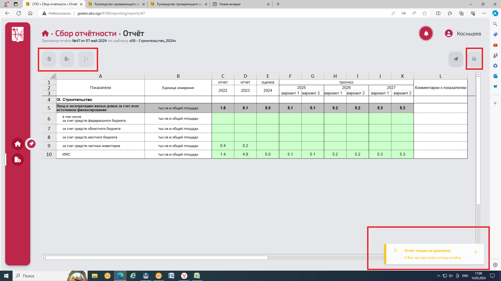
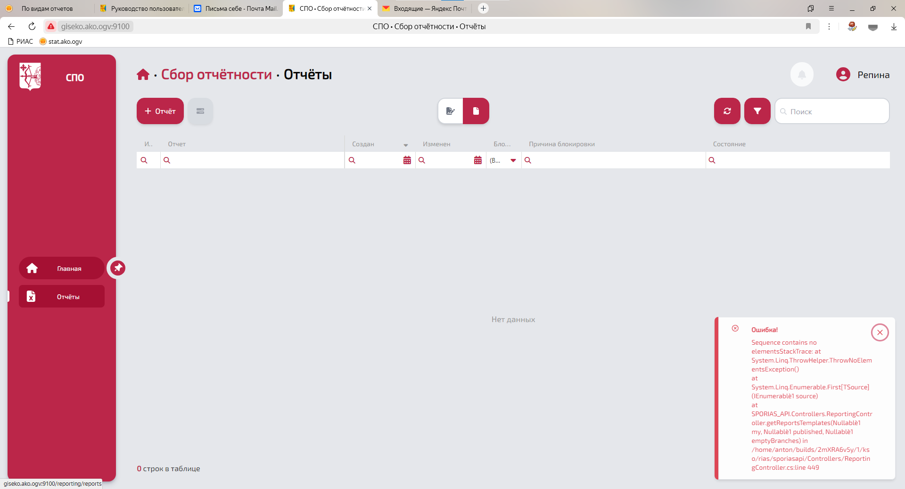
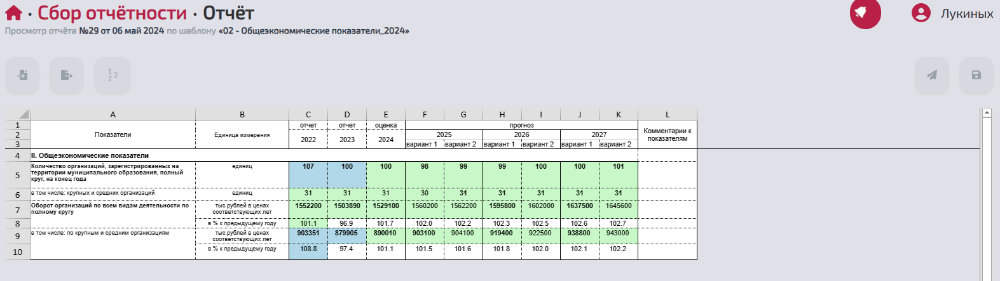
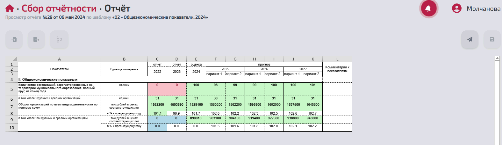

1. Gitlab: поудалял пользователей и попереформатировал группы
2. РИАС:

> [!quote] Костя
> Проверяющему открыть выгрузку в Excel

3. РИАС:

> [!quote] Марина
> Излишняя инфа для утверждающего. Можно не показывать эти кнопки и уведомления вообще. И вместо дискетки может можно сделать кнопку "Вернуть", типа альтернативный вариант к утверждению.

4. РИАС: обработка ошибки отсутствия группы пользователя

5. РИАС: опять фикс проверки логина при создании пользователя
6. РИАС:

> [!quote] Марина
> У заполняющего видно числа, у проверяющего нули в ячейках. Надо поправить

7. 