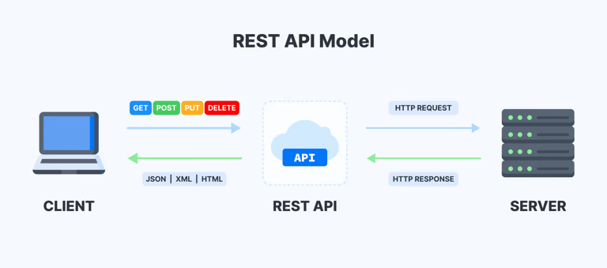

# REST API

#programming #api/rest #api/design #backend #engineering #api/architecture
#программирование #апи/проектирование #бэк #бэкенд #проектирование #api/архитектура

***
*Краткий обзор архитектурного стиля проектирования приложений*
***

## Базовая информация

**REST** (от англ. **Re**presentational **S**tate **T**ransfer — «передача репрезентативного состояния» или «передача „самоописываемого“ состояния») — архитектурный стиль взаимодействия компонентов распределённого приложения в сети. Другими словами, REST — это набор правил того, как программисту организовать написание кода серверного приложения, чтобы все системы легко обменивались данными и приложение можно было масштабировать. REST представляет собой согласованный набор ограничений, учитываемых при проектировании распределённой системы. REST является альтернативой [RPC](RPC).

В вызов удалённой процедуры может представлять собой обычный HTTP-запрос (обычно [GET](../Общее/Методы%20HTTP.md#GET) или [POST](../Общее/Методы%20HTTP.md#POST)), а необходимые данные передаются в качестве [Параметризация маршрутов](Параметризация%20маршрутов.md) запроса.

Для приложений, построенных с учётом REST (то есть не нарушающих накладываемых им ограничений), применяют термин «**RESTful**».

Не существует «официального» стандарта для RESTful веб-API, так как REST является **архитектурным стилем**. Несмотря на то, что REST не является стандартом сам по себе, как правило использует такие стандарты, как [HTTP](HTTP), [URL](URL), [JSON](JSON) и, реже, XML.

REST следует ресурсно-ориентированному дизайну, который состоит из нескольких концепций:

- **[ресурсы](#Ресурсы)** - часть данных, все что нужно показать пользователю (например, пользователь, задача, товар и т.д.)
- **коллекция** - группа ресурсов (например, список экземпляров пользователей, задач, товаров и т.д.) ^ceef4f
- **URI (универсальный идентификатор ресурса)** или **маршрут** - местоположение ресурса или коллекции (например, /users или /user/{:id}), «имя», которое привязано к одной или нескольким конечным точкам. Самый распространенный тип - [URL (унифицированный указатель ресурса)](URL), который является полноценным веб-адресом ^d7a406
- **конечная точка** или **эндпоинт** - программный код, скрытый за маршрутом, выполняющий возложенную на него задачу, принимающий параметры и возвращающий данные  после обработки ^46a1a5

В общем виде взаимодействие согласно REST выглядит следующим образом:

## Ресурсы

Ресурс — это ключевая абстракция информации. Любой вид информации, который мы можем использовать, может быть ресурсом: документ, изображение, временный сервис.

Состояние ресурса в любой определенный момент называется представлением ресурса. Оно состоит из:
-   данных;
-   метаданных, описывающих данные;
-   гипермедиа ссылок, которые помогают клиентам перейти в следующее состояние.

## Формат данных

Данные могут доставляться клиенту в любом формате: JSON, HTML, XLT, Python, PHP или простой текст. [JSON](JSON) наиболее популярен, потому что он читабелен для машин и людей и не зависит от языка программирования.

## Транспорт

REST полностью построен на основе HTTP, который описывает, что должно быть сделано с ресурсом с помощью [основных методов](../Общее/Методы%20HTTP.md)

HTTP определяет следующую структуру запроса:  
  
-   строка запроса (**request line**) — определяет тип сообщения
-   заголовки запроса (**header fields**) — характеризуют тело сообщения, параметры передачи и прочие сведения
-   тело сообщения (**body**) — необязательное

HTTP определяет следующую структуру ответного сообщения (response):  
  
-   строка состояния (**status line**), включающая [код состояния](Коды%20состояния%20%20HTTP) и сообщение о причине
-   поля заголовка ответа (**header fields**)
-   дополнительное тело сообщения (**body**)

## Основные принципы REST

#### Client-server

REST имеет клиент-серверную архитектуру. Клиентом является тот, кто отправляет запросы на ресурсы и никак не связан с хранилищем данных. Хранение данных остается внутри сервера. Серверы же не связываются с пользовательским интерфейсом. Другими словами, клиент и сервер независимы друг от друга и могут развиваться отдельно, что делает REST API более гибким и масштабируемым.

#### Uniform Interface

Унифицированный интерфейс или единый интерфейс — это главное, что отличает REST API от других видов. Он предполагает наличие единого способа взаимодействия с сервером вне зависимости от типа устройства или приложения.

Единый интерфейс включает в себя четыре основных принципа: 

1. **Identification of resources**. Каждый ресурс в REST имеет [идентификатор](#^d7a406), который не зависит от состояния ресурса. В роли идентификатора выступает URL.
2.  **Manipulation of resources through representations** (манипулирование ресурсами через представления). Клиент имеет представление ресурса, которое содержит данные для его удаления или изменения. Клиент отправляет представление на сервер (объект JSON), который он хочет изменить, удалить или добавить.
3.  **Self-descriptive messages** (самодокументируемые сообщения). Такие сообщения содержат нужную информацию для получателя, чтобы понять ее. Никакой дополнительной информации не требуется в отдельной документации или сообщениях. Каждое сообщение имеет достаточную информацию, чтобы сервер легко проанализировал запрос.
4.  **Hypermedia as the engine of application state** (гипермедиа как двигатель состояния приложения). Гипермедиа подразумевает использование ссылок для каждого ответа, чтобы клиент мог найти другие ресурсы. Таким образом все взаимодействия в REST проходят через гипермедиа.

#### Stateless (без состояния)

Сервер не содержит никакой информации о клиенте. Каждый запрос включает всю необходимую информацию для обработки. Информация о сессии полностью хранится на стороне клиента.

#### Cacheable (кэшируемость)

Каждый ответ должен содержать данные о том, является ли он кэшируемым или нет и в течение какого времени ответ может быть кэширован на стороне клиента. Если ответ может быть кэширован, то в последующих похожих запросах клиент может использовать те же данные без повторного обращения на сервер. При правильном использовании это улучшает производительность и доступность.